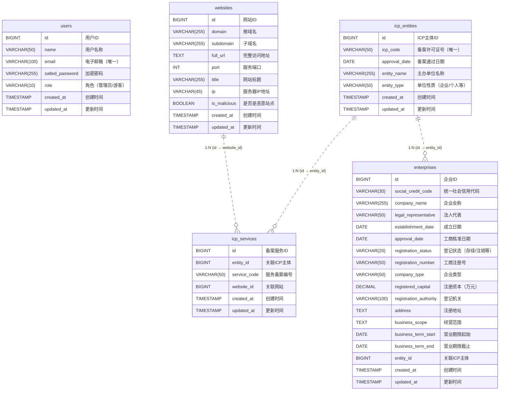

# 网站相关数据库设计

## 需求分析

### 前端关键词：
- 登录注册模块
- 域名：域名、子域名、完整URL、端口、路径、标题
- 备案：备案号、国家、省份、城市、主体性质(企业/个人)
- 注册：注册机构、注册人、注册事件、商标、版权
- 技术组成：技术(Nginx、WordPress等)、服务器ip
- 运营商：isp、cdn、带宽提供商
- 部署：服务器位置、数据中心、反向代理

### 信息整理
- 用户信息：
  - 姓名、游戏、密码、身份
- 网站:
  - 域名、子域名、完整URL、端口、标题、ip、是否是恶意下载站
- icp备案：
  - 主体信息：
    - ICP备案/许可证号、审核通过日期、主办单位名称、主办单位性质 (企业/个人)
  - 服务信息：
    - ICP备案/许可证号、网站域名
- 企业信息公示：
  - 营业执照信息:
    - 统一社会信用代码、企业名称、法定代表人、成立日期、核准日期、登记状态、注册号、类型、注册资本、登记机关、住所、经营范围
  - 营业期限信息：
    - 营业期限自、营业期限至

说明：
  - ipc备案主体信息：标识备案主体（个人或公司），具有全局唯一性和长期稳定性。
  - icp备案服务信息：标识具体网站或服务，基于主体备案号生成，编号随网站数量递增。

  > 不需要的数据库：Whois(全球):
  >  域名信息：网站域名可更换，所以意义不大(如一个域名有23年历史，与当前网站运行关系不大)
  >  注册商信息：域名注册商、与网站无直接关联

## 逻辑设计

### 关系模型

1. 网站表(websites)
   - 主要存储网站基本信息
   - 一个网站可以有一个或多个ICP备案服务记录
   - 核心字段：域名、URL、IP等

2. ICP备案主体表(icp_entities)
   - 存储ICP备案主体信息
   - 一个主体可以关联多个服务备案
   - 一个主体可以关联一个企业信息
   - 核心字段：备案号、主办单位信息等

3. ICP备案服务表(icp_services) 
   - 存储具体网站的备案信息
   - 与备案主体是多对一关系
   - 与网站是一对一关系
   - 作为websites和icp_entities的关联表
   - 核心字段：服务备案号等

4. 企业信息表(enterprises)
   - 存储企业详细信息
   - 与ICP备案主体是一对一关系（当主体类型为企业时）
   - 核心字段：统一社会信用代码、营业执照信息等


### 规范化理论

- 符合第一范式(1NF): 所有字段都是原子性的
- 符合第二范式(2NF): 所有非主键字段完全依赖于主键
- 符合第三范式(3NF): 所有非主键字段都只依赖于主键

### 定义完整数据结构

1. 用户表(users)
```sql
CREATE TABLE users (
    id BIGINT PRIMARY KEY AUTO_INCREMENT,
    name VARCHAR(50) NOT NULL,
    email VARCHAR(100) NOT NULL UNIQUE,
    salted_password VARCHAR(255) NOT NULL,
    role ENUM('管理员', '游客') NOT NULL,
    created_at TIMESTAMP DEFAULT CURRENT_TIMESTAMP，
    updated_at TIMESTAMP DEFAULT CURRENT_TIMESTAMP ON UPDATE CURRENT_TIMESTAMP
);
```

2. 网站表(websites)
```sql
CREATE TABLE websites (
    id BIGINT UNSIGNED PRIMARY KEY AUTO_INCREMENT,
    domain VARCHAR(255) NOT NULL COMMENT '域名',
    subdomain VARCHAR(255) COMMENT '子域名',
    full_url TEXT NOT NULL COMMENT '完整URL',
    port INT COMMENT '端口',
    title VARCHAR(255) COMMENT '网站标题',
    ip VARCHAR(45) COMMENT '服务器IP',
    is_malicious BOOLEAN DEFAULT FALSE COMMENT '是否是恶意站点',
    created_at TIMESTAMP DEFAULT CURRENT_TIMESTAMP,
    updated_at TIMESTAMP DEFAULT CURRENT_TIMESTAMP ON UPDATE CURRENT_TIMESTAMP
);
```

3. ICP备案主体表(icp_entities)
```sql
CREATE TABLE icp_entities (
    id BIGINT UNSIGNED PRIMARY KEY AUTO_INCREMENT,
    icp_code VARCHAR(50) NOT NULL UNIQUE COMMENT 'ICP备案/许可证号',
    approval_date DATE COMMENT '审核通过日期',
    entity_name VARCHAR(255) NOT NULL COMMENT '主办单位名称',
    entity_type VARCHAR(50) NOT NULL COMMENT '主办单位性质',
    created_at TIMESTAMP DEFAULT CURRENT_TIMESTAMP,
    updated_at TIMESTAMP DEFAULT CURRENT_TIMESTAMP ON UPDATE CURRENT_TIMESTAMP
);
```

4. ICP备案服务表(icp_services)
```sql
CREATE TABLE icp_services (
    id BIGINT UNSIGNED PRIMARY KEY AUTO_INCREMENT,
    entity_id BIGINT UNSIGNED NOT NULL COMMENT '关联的主体ID',
    service_code VARCHAR(50) NOT NULL COMMENT '服务备案号',
    website_id BIGINT UNSIGNED NOT NULL COMMENT '关联的网站ID',
    created_at TIMESTAMP DEFAULT CURRENT_TIMESTAMP,
    updated_at TIMESTAMP DEFAULT CURRENT_TIMESTAMP ON UPDATE CURRENT_TIMESTAMP,
    FOREIGN KEY (entity_id) REFERENCES icp_entities(id),
    FOREIGN KEY (website_id) REFERENCES websites(id)
);
```

5. 企业信息表(enterprises)
```sql
CREATE TABLE enterprises (
    id BIGINT UNSIGNED PRIMARY KEY AUTO_INCREMENT,
    social_credit_code VARCHAR(30) UNIQUE COMMENT '统一社会信用代码',
    company_name VARCHAR(255) NOT NULL COMMENT '企业名称',
    legal_representative VARCHAR(50) COMMENT '法定代表人',
    establishment_date DATE COMMENT '成立日期',
    approval_date DATE COMMENT '核准日期',
    registration_status VARCHAR(20) COMMENT '登记状态',
    registration_number VARCHAR(50) COMMENT '注册号',
    company_type VARCHAR(50) COMMENT '类型',
    registered_capital DECIMAL(15,2) COMMENT '注册资本',
    registration_authority VARCHAR(100) COMMENT '登记机关',
    address TEXT COMMENT '住所',
    business_scope TEXT COMMENT '经营范围',
    business_term_start DATE COMMENT '营业期限开始',
    business_term_end DATE COMMENT '营业期限结束',
    entity_id BIGINT UNSIGNED COMMENT '关联的ICP主体ID',
    created_at TIMESTAMP DEFAULT CURRENT_TIMESTAMP,
    updated_at TIMESTAMP DEFAULT CURRENT_TIMESTAMP ON UPDATE CURRENT_TIMESTAMP,
    FOREIGN KEY (entity_id) REFERENCES icp_entities(id)
);

```
### ER图



# 其他功能：

  网站相似度分析、网站同源性分析、人员追踪

  人员：纳税人识别号、相关网站、相关恭喜、相关人员、相关链接、相关ip、旗下资产、行为动态

  网站HTML特征，大模型识别一部分网站，然后获取数据自己训练模型？
      Document长度
      平均词长度
      单词数量
      不同词数量
      每行词数量
      空字符数量
      是否用了字符串连接操作
      非对称HTML标签数量
      <link href=".">的数量
      隐藏对象的数量iframe的数量
      size=0的iframe数量
      行数
      超链接的数量
      链接中非本域名的数量
      HTML中特定词汇的数量